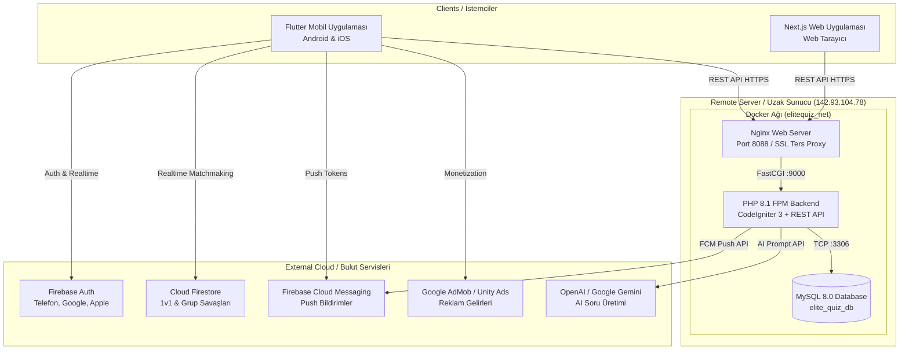

# Quiza (Elite Quiz v2.3.9.1) — Sistem Mimarisi (System Architecture)

Bu belge, **Quiza (Elite Quiz v2.3.9.1)** ekosisteminin tüm bileşenlerini, veri akışını, entegrasyonlarını ve güvenlik modellerini açıklamaktadır. Sonraki geliştirmeler ve bakım çalışmaları için ana mimari başvuru kaynağıdır.

---

## 1. Ekosistem Genel Bakış (System Topology)

Quiza; yönetim paneli, RESTful API katmanı, veritabanı, bulut servisleri ve çoklu istemcilerden (Mobil & Web) oluşan modüler ve ölçeklenebilir bir mimariye sahiptir:

---

## 2. Temel Katmanlar ve Teknolojiler

### Katman A: Yönetim Paneli & API Motoru (Backend)
- **Çekirdek:** PHP 8.1 FPM, CodeIgniter 3 Framework
- **Mimari:** MVC (Model-View-Controller) + HMVC / REST Controller
- **Konum:** Sunucu üzerinde `/opt/elitequiz/backend`
- **Görevleri:**
  - Kategoriler, Alt Kategoriler, Seviyeler ve Soru Bankası yönetimi.
  - Sınav Modları: Normal Quiz, Guess The Word, Audio Quiz, Math Quiz, True/False, Fun 'N' Learn, Daily Quiz, Contest (Yarışma).
  - Kullanıcı skorları, jetonlar, rozetler (Badges) ve cüzdan/ödül talepleri.
  - Yapay Zeka (AI) ile tek tıkla soru ve şık üretimi (OpenAI GPT-4o & Google Gemini entegrasyonu).
  - Mobil ve web uygulamalarına JSON formatında yüksek performanslı veri sunumu.

### Katman B: Veritabanı (Database)
- **Motor:** MySQL 8.0 (InnoDB, `utf8mb4_unicode_ci`)
- **Container:** `elitequiz_db` (İzole `elitequiz_net` ağı içerisinde, dış dünyaya port açılmaz, yalnızca `elitequiz_api` ile haberleşir).
- **Yedekleme:** Otomatik günlük SQL dökümleri ve Docker volume izolasyonu.

### Katman C: Web Sunucusu ve Ters Proxy (Web Server)
- **Motor:** Nginx Alpine (`elitequiz_webserver`)
- **Port:** `0.0.0.0:8088->80/tcp`
- **Konfigürasyon:** CodeIgniter 3 `index.php?$query_string` URL yeniden yazma (URL rewrite) kuralları, Statik dosya önbellekleme (`/uploads/`, `/assets/`), 64MB maksimum yükleme sınırı.

### Katman D: Mobil Uygulama (Flutter Client)
- **Versiyon:** Flutter 3.38+ / Dart 3.10+
- **Paket Adı:** `flutterquiz` (Sonraki aşamada `com.quiza.app` olarak özelleştirilecek)
- **Durum Yönetimi (State Management):** `flutter_bloc`
- **Lokal Veritabanı:** `hive` & `hive_flutter`
- **Çoklu Platform:** Android (Google Play) & iOS (App Store)

### Katman E: Bulut & Gerçek Zamanlı Servisler (Cloud Services)
- **Firebase Authentication:** Telefon numarası (SMS OTP), Google Sign-In, Sign in with Apple ve E-posta/Şifre ile güvenli kimlik doğrulama.
- **Cloud Firestore:** Gerçek zamanlı 1v1 Battle (Düello) ve Çoklu Grup Savaşları için düşük gecikmeli oda yönetimi ve anlık puan senkronizasyonu.
- **Firebase Cloud Messaging (FCM):** Yönetim panelinden tüm kullanıcılara veya belirli segmentlere toplu bildirim gönderimi.

---

## 3. Güvenlik ve İzolasyon Modeli

1. **Sunucu İçi Servis İzolasyonu:**
   - Uzak sunucuda (`142.93.104.78`) 4 farklı aktif proje daha bulunmaktadır (`portfolio-2025`, `kizkiza`, `sharka-web`, `pokebook-web`).
   - Quiza, bağımsız Docker bridge ağı (`elitequiz_net`) ve bağımsız port (`8088`) üzerinde çalışır. Diğer projelerin ağlarına ve veritabanlarına müdahale etmez.
2. **API Güvenliği:**
   - JWT / API Key doğrulaması (`access_key`).
   - SQL Injection koruması (CodeIgniter Active Record / Prepared Statements).
   - XSS ve CSRF filtreleme aktif.
3. **Yönetim Paneli Güvenliği:**
   - Kurulum sihirbazı (`install/`) devreye alma sonrası fiziksel olarak silinir.
   - Parolalar Bcrypt algoritması ile tuzlanarak (salted) saklanır.
   - Brute-force denemelerine karşı oturum kilitleme ve yetkilendirme rolleri.
